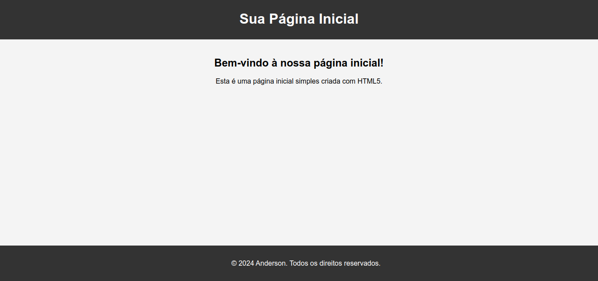

# Projeto de Estudos em Django

Bem-vindo ao repositório do projeto de estudos em Django! Este projeto foi criado com o objetivo principal de aprimorar habilidades no framework Django, proporcionando uma oportunidade de aprendizado e prática.

## Descrição do Projeto
### Inspirado em um proposta de trabalho do **workana**:

Portal on line para cadastrar, delegar, monitorar e auditar uma demanda de RH. Um exemplo seriam uma ouvidoria:
**1.** O funcionário acessa um link;
**2.** O funcionário cadastra sua demanda/denúncia;
**3.** O responsável recebe um e-mail avisando da respectiva ouvidoria;
**3.** O responsável analisa e encaminha para outro usuário responsável por executar um plano de ação;
**4.** Após vencimento do prazo de solução, o sistema avisará o responsável maior;
**5.** Após executado o plano de ação, volta o retorno para o gestor do processo, que  por sua vez retorna para o funcionário que gerou a demanda;
**6.** O sistema deverá quantificar os indicadores;
**7.** O Sistema deverá gerar os respectivos relatórios.

## Objetivos de Aprendizado

Os principais objetivos deste projeto incluem:

- **Modelos Django:** Explorar a criação e manipulação de modelos para a definição de dados no banco de dados.
- **Views e Templates:** Compreender a lógica por trás das views e a criação de templates para renderizar as páginas web.
- **URLs e Roteamento:** Aprender a configurar URLs e realizar o roteamento eficientemente.
- **Formulários Django:** Implementar a manipulação de dados por meio de formulários Django.
- **Autenticação e Autorização:** Explorar os aspectos de autenticação e autorização para garantir a segurança da aplicação.
- **Integração de Imagens:** Trabalhar com o carregamento e exibição de imagens em um contexto Django.

## Estrutura do Projeto

A estrutura do projeto é organizada para facilitar o aprendizado progressivo. Cada etapa aborda um aspecto específico do desenvolvimento web com Django, acompanhado por exemplos práticos e exercícios.

## Como Iniciar

1. Clone o repositório: `git clone https://github.com/seu-usuario/nome-do-projeto.git`
2. Crie um ambiente virtual: `python -m venv env`
3. Ative o ambiente virtual: 
   - No Windows: `env\Scripts\activate`
   - No macOS/Linux: `source env/bin/activate`
4. Instale as dependências: `pip install -r requirements.txt`
5. Execute as migrações: `python manage.py migrate`
6. Inicie o servidor de desenvolvimento: `python manage.py runserver`

## Contribuições

Contribuições são bem-vindas! Se você tem sugestões, correções ou novas funcionalidades para adicionar, sinta-se à vontade para abrir uma issue ou enviar um pull request.

Divirta-se aprendendo Django! 🚀
